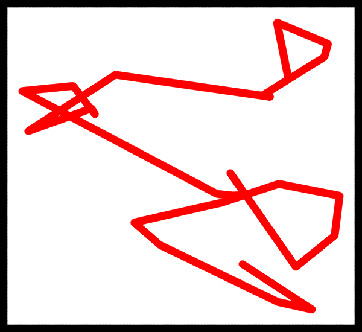
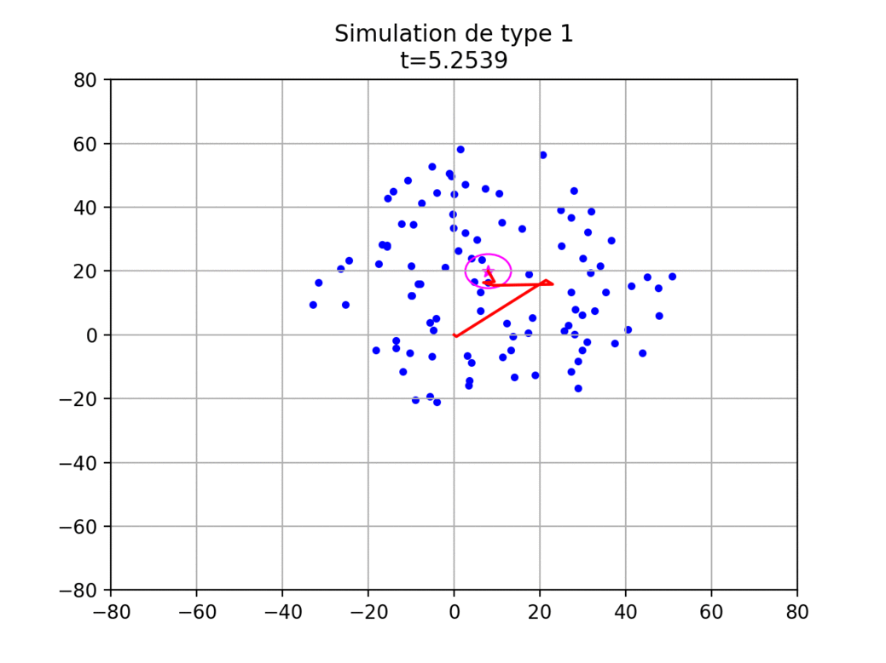
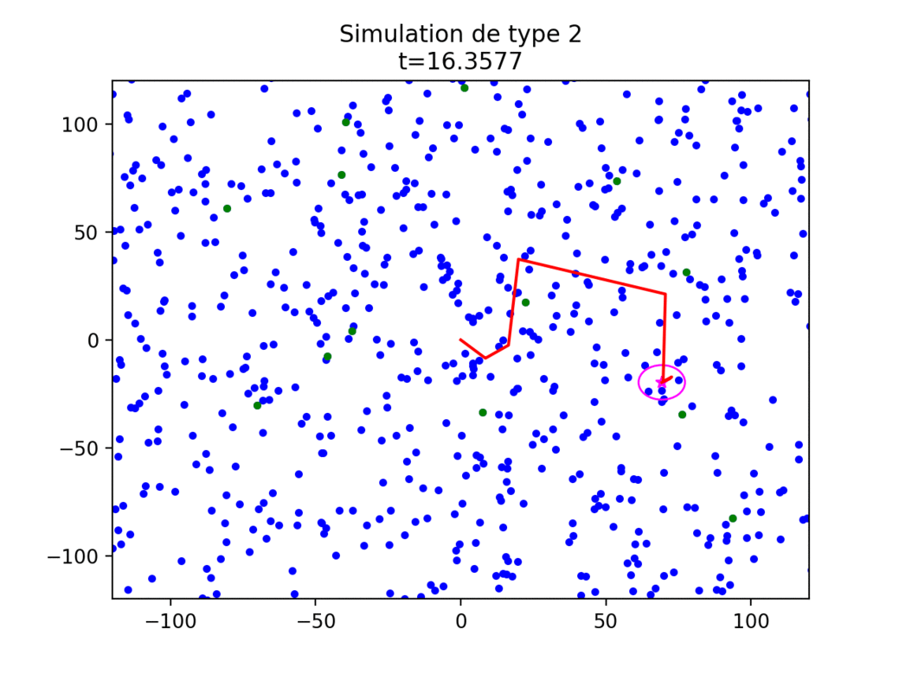
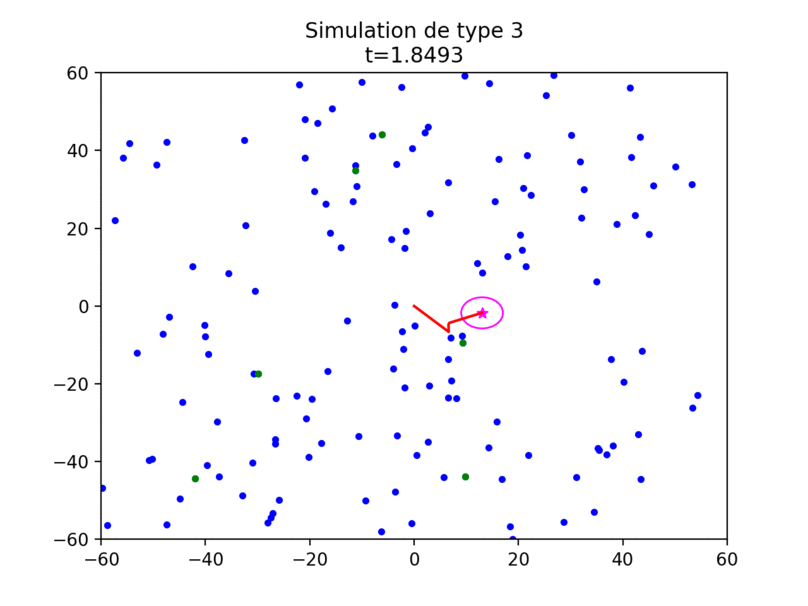

# brownian
 
Modélisation d'un mouvement brownien

## Table des matières
* [A. Informations générales](#a-informations-générales)
* [B. Modélisations](#b-modélisations)
  - [Simulation de type 1](#simulation-de-type-1)
  - [Simulation de type 1.1](#simulation-de-type-11)
  - [Simulation de type 2](#simulation-de-type-2)
  - [Simulation de type 3](#simulation-de-type-3)
  - [Mesures](#mesures)
* [C. Installation](#c-installation)
* [D. Exemples](#d-exemples)
* [E. Utilisation](#e-utilisation)
* [F. Fonctionnalités](#f-fonctionnalités)


## A. Informations générales

Ce projet fournit différentes modélisations d'un mouvement brownien.

## B. Modélisations

Dans les différents modèles, nous suivons le mouvement d'une grosse particule dans un environnement constitué de nombreuses petites particules aléatoires.

### Simulation de type 1

**Utilisation de plusieurs petits environnements définis à chaque collision.**

 

#### Algorithme 
Date t : Génération d’un environnement aléatoire centré autour de la grosse particule (de rayon )). 

* Cas 1 : si aucune collision pendant la durée h, on fait avancer la grosse particule jusqu’à , puis on régénère un nouvel environnement à cette position et au temps t + h

* Cas 2 : si une collision existe entre t et t+h (donc à l’intérieur du disque), on définit Δt la durée avant la première collision. On fait avancer la grosse particule jusqu’à la collision, puis on définit un nouvel environnement à cette position et au temps t + Δt. On change aléatoirement l’angle de la vitesse de la grosse particule.

#### Caractéristiques du modèle
1. Non prise en compte des collisions des petites particules
2. Environnement ouvert (sans rebond des petites particules), pas de génération de petite particule lorsqu’une petite particule sort de l’environnement
3. Plusieurs environnements

### Simulation de type 1.1

**Amélioration de la simulation de type 1.1.**

### Simulation de type 2

**Utilisation d'un grand environnement unique.**



#### Algorithme 

On génère un unique et grand environnement aléatoire carré (de côté 2\*dim) centré autour de la grosse particule. 

A la première grosse collision possible à la date t + Δt, on fait avancer toutes les petites particules et la grosse particule pendant Δt. On change aléatoirement l’angle de la vitesse de la grosse particule et de la petite particule en collision. Si un petite particule se trouve hors de l’environnement (carré) on la supprime et on redéfinit une petite particule aléatoirement dans l’environnement.

#### Caractéristiques
1. Non prise en compte des collisions des petites particules
2. Environnement ouvert (sans rebond des petites particules), génération d’une petite particule aléatoire à chaque sortie d’une petite particule (pour avoir une densité constante)
3. Unique environnement


### Simulation de type 3

**Prise en compte des collisions des petites particules de l'environnement.**



#### Algorithme
Génération d’un unique et grand environnement aléatoire carré (de côté 2*dim) centré autour de la grosse particule. 

On détermine la première petite collision possible (date t + Δt1) et la première grosse collision possible (date t + Δt2).

* Si Δt1 < Δt2 (avec éventuellement Δt2 = ∞ si aucune grosse collision possible): on fait avancer toutes les particules pendant Δt1, puis on change aléatoirement l’angle des vitesses des deux petites particules en collision.
* Si Δt2 < Δt1 (avec éventuellement Δt1 = ∞ si aucune petite collision possible): on fait avancer toutes les particules pendant Δt2, puis on change aléatoirement l’angle des vitesses de la grosse particule et de la petite particule en collision.

Dans tous les cas, on vérifie à t + Δt  si une petite particule se trouve hors de l’environnement (carré): on la supprime et on redéfinit une petite particule aléatoirement dans l’environnement.

#### Caractéristiques
1. Prise en compte des collisions des petites particules
2. Environnement ouvert (sans rebond des petites particules), génération d’une petite particule aléatoire à chaque sortie d’une petite particule (pour avoir une densité constante)
3. Unique environnement


### Mesures 

Les outils fournissent des mesures sur les trajectoires calculées :
* Fréquence des grosses collisions
* LPM
* Distance moyenne de la grosse particule par rapport à sa position initiale
* Dsitance maximale de la grosse particule par rapport à sa poisition initiale

## C. Installation

Clone the respository and run `python setup.py install`, or `pip install git+https://github.com/baptiste-pasquier/brownian`.

Exécution des tests unitaires
```
python -m pytest
```

## D. Exemples
* Affichage d'une simulation de type 1 et 2 : [example.py](examples/example.py)

* Affichage d'une vidéo de simulation de type 2 : [movie.py](examples/movie.py)

* Calcul des statistiques en multiprocessing : [calcul1.py](examples/calcul/calcul1.py) pour le modèle 1 et [calcul2.py](examples/calcul/calcul2.py) pour le modèle 2.

* Profiling des simulations : [profiler.py](examples/profiling/profiler.py)

* Affichage de plusieurs méthodes de génération aléatoire de points dans un disque : [generation_aleatoire.py](examples/generation_aleatoire.py)


## E. Utilisation

* Initialisation d'une simulation
```
from brownian.simulation1 import Simulation1
from brownian.outils import stats
a = Simulation1()
```
Il est possible de personnaliser les paramètres de la simulation, voir le fichier [example.py](examples/example.py).

* Execution d'un calcul
```
a.calcul()
```
Le paramètre `show=True` permet d'afficher les différentes étapes de la simulation.

* Affichage des statistiques du dernier calcul effectué
```
stats(a, show=True)
```

* Affichage de la trajectoire du dernier calcul effectué
```
a.traj_image()
```
Il est possible de refaire d'exécuter d'autres calculs avec les mêmes paramètres de simulation avec la commande `a.calcul()`.


## F. Fonctionnalités
List of features ready and TODOs for future development


