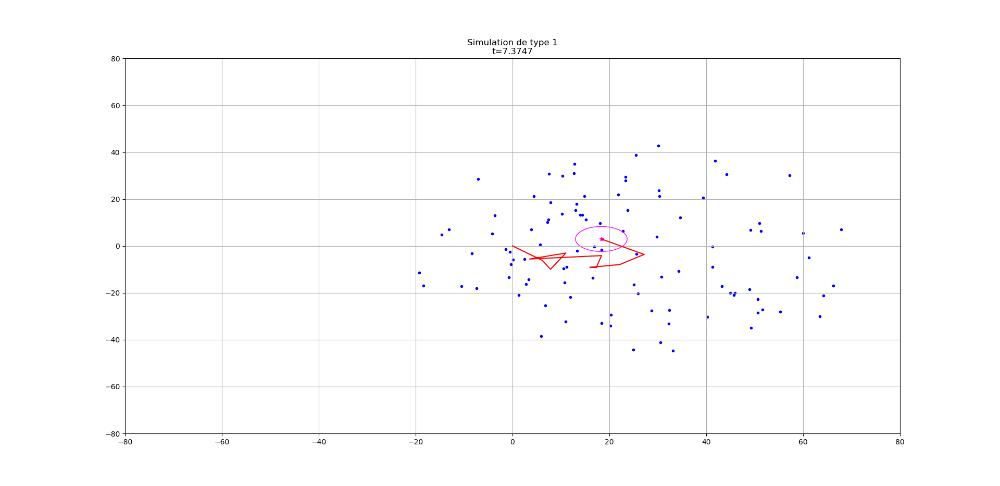

# brownian
Modélisation d'un mouvement brownien

## Table des matières
* [Informations générales](#informations-générales)
* [Modèles](#Modèles)
* [Screenshots](#screenshots)
* [Technologies](#technologies)
* [Setup](#setup)
* [Features](#features)

## Informations générales

Ce projet fournit différentes simulations d'un mouvement brownien.

## Modèles

### Simulation de type 1

Fichier : [simulation1.py](simulation1.py)

t : Génération d’un environnement aléatoire centré autour de la grosse particule (de rayon h*(v+V)). 

* Cas 1 : si aucune collision pendant la durée h, on fait avancer la grosse particule jusqu’à t+Δh, puis on régénère un nouvel environnement à cette position et au temps t + h

* Cas 2 : si une collision existe entre t et t+h (donc à l’intérieur du disque), on définit Δt la durée avant la première collision. On fait avancer la grosse particule jusqu’à la collision, puis on définit un nouvel environnement à cette position et au temps t + Δt. On change aléatoirement l’angle de la vitesse de la grosse particule.

*Caractéristiques :*
1. Non prise en compte des collisions des petites particules
2. Environnement ouvert (sans rebond des petites particules), pas de génération de petite particule lorsqu’une petite particule sort de l’environnement
3. Plusieurs environnements

### Simulation de type 2

Fichier : [simulation2.py](simulation2.py)

Génération d’un unique et grand environnement aléatoire carré (de côté 2*dim) centré autour de la grosse particule. 

A la première grosse collision possible à la date t + Δt, on fait avancer toutes les petites particules et la grosse particule pendant Δt. On change aléatoirement l’angle de la vitesse de la grosse particule et de la petite particule en collision. Si un petite particule se trouve hors de l’environnement (carré) on la supprime et on redéfinit une petite particule aléatoirement dans l’environnement.

*Caractéristiques :* 
1. Non prise en compte des collisions des petites particules
2. Environnement ouvert (sans rebond des petites particules), génération d’une petite particule aléatoire à chaque sortie d’une petite particule (pour avoir une densité constante)
3. Unique environnement

### Simulation de type 3

Fichier : [simulation3.py](simulation3.py)

Génération d’un unique et grand environnement aléatoire carré (de côté 2*dim) centré autour de la grosse particule. 

On détermine la première petite collision possible (date t + Δt1) et la première grosse collision possible (date t + Δt2).

* Si Δt1 < Δt2 (avec éventuellement Δt2 = ∞ si aucune grosse collision possible): on fait avancer toutes les particules pendant Δt1, puis on change aléatoirement l’angle des vitesses des deux petites particules en collision.
* Si Δt2 < Δt1 (avec éventuellement Δt1 = ∞ si aucune petite collision possible): on fait avancer toutes les particules pendant Δt2, puis on change aléatoirement l’angle des vitesses de la grosse particule et de la petite particule en collision.

Dans tous les cas, on vérifie à t + Δt  si une petite particule se trouve hors de l’environnement (carré): on la supprime et on redéfinit une petite particule aléatoirement dans l’environnement.

*Caractéristiques :*
1. Prise en compte des collisions des petites particules
2. Environnement ouvert (sans rebond des petites particules), génération d’une petite particule aléatoire à chaque sortie d’une petite particule (pour avoir une densité constante)
3. Unique environnement

## Screenshots

## Technologie
* Python - version 3.7

## Installation
Describe how to install / setup your local environement / add link to demo version.

## Exemples
Affichage d'une simulation de type 1 et 2
`python example.py`

Affichage d'une vidéo de simulation de type 2
`python movie.py`

## Fonctionnalités
List of features ready and TODOs for future development

* Calcul en multiprocessing : `python calcul1.py` pour le modèle 1 et `python calcul2.py` pour le modèle 2.

* Différentes méthodes de génération aléatoire de points dans un disque `python generation_aleatoire.py`

* Profiling des simulations `python profiler.py`

